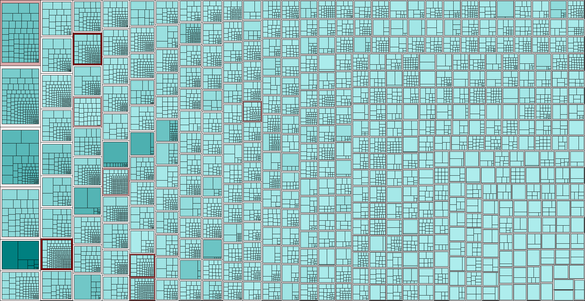

# Java Metrics Analyzer
The production of software happens at an extremely fast rate. Often, people mention and compare this rapid pace of software development to the eruption of a volcano. The erupting volcano is not only a metaphor for the astronomical amount of software that is produced by the set of all programmers, but also the amount of bad software that gets spewed all across various codebases. 

Eruptions are chaotic and unpredictable, often resulting in environmental effects that can have a lasting impact on the community living in the area and its enclosing society. Comparatively, chaotic and unpredictable software can have serious consequences ranging from business bankruptcy, where essential jobs are lost and the economy suffers, to an airplane crashing due to software errors. Software quality is therefore a goal to work towards for any endeavor, be it a small startup or a juggernaut like Google. 

## Software Quality
To set the first steps in motion in the process of attaining software quality, it is strongly advised to write software adhering to a quality model. One such example would be the [ISO 25010](https://iso25000.com/index.php/en/iso-25000-standards/iso-25010) standard that divides quality attributes in 8 sub catagories. Their definition of the quality of software is the degree to which the software system satisfies the stated and implied needs of its various stakeholders, and thus provides value. This definition encompasses a variety of fields, which is why the distribution of 8 sub categories was made. 

Regarding the 8 categories of [ISO 25010](https://iso25000.com/index.php/en/iso-25000-standards/iso-25010), an interesting quality attribute concerning the software volcano methaphor that was mentioned in the beginning is software maintainability. This characteristic represents the degree of effectiveness and efficiency with which a product or system can be modified to improve it, correct it or adapt it to changes in the environment (i.e., new features/requirements). The following 5 properties are related to software maintainability:
- Modularity
- Reusability
- Analysability
- Modifiability
- Testability

## Software metrics project
The project in this repository was made as a lab assignment for the master course Software Quality Management at the [Open University](https://www.ou.nl/). The project allows for the static analysis and visualisation of a set of software metrics for arbitrary Java codebases. Consider the following table for a mapping between the various software metrics and the maintainability properties described in the preceding section.

_Figure 1 - Maintainability matrix according to ISO 9126/25010 and [SIG](https://www.softwareimprovementgroup.com/)._

### Volume & Unit size
The volume metric is a count that measures the number of lines written in `.java` files that are found in the input project folder path. These are the physical lines of code (PLOC). Comment lines, java docs, empty lines, and leading/trailing spaces where excluded from the count, as they rarely impact the maintainability of a system. An additional metric regarding the size of units, i.e., methods in Java, is also provided, indicating both the total number of methods in the `.java` files and an aggregated risk mapping.

### Complexity per unit
The cyclomatic complexity metric measures the number of linearly-independent paths through the control flow of a program. Software that diverges in control, whether through if/while statements or logical operators, creates a larger set of outputs that the software can produce. This leads to more test-cases that need to be created, which ultimately makes the system in question more complex. Results per method were aggregated into a risk mapping according to the methods of the [Software Improvement Group](https://www.softwareimprovementgroup.com/).

### Duplication
The percentage of code that is already exists in the system as duplicates is measured with a sliding window of 6 lines, that goes through each block of 6 lines and compares them to the rest of the codebase. 

### Unit testing
Better known as test coverage. This metric measures the amount of code as a percentage that is covered by tests. The implementation does this on the method-level, as tests in Java should revolve around the behaviour of objects. 

### Rascal
The metaprogramming language [Rascal](https://www.rascal-mpl.org/) was used to analyse and visualise arbitrary Java projects. The following figures show the generated interactive visualisation based on the calculated metrics. 

_Figure 2 - Treemap view of the analysed smallsql system._

_Figure 3 - Treemap view of the analysed hsql system._